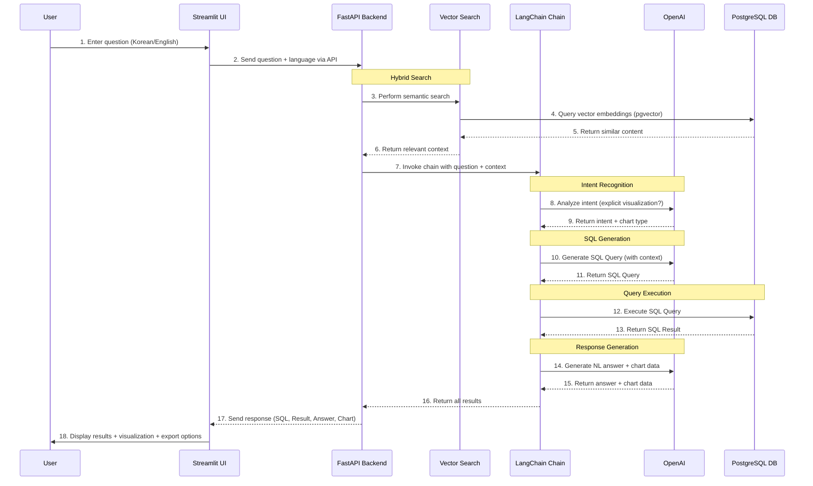

# 📀 LangChain, FastAPI, Streamlit을 이용한 Text-to-SQL

이 프로젝트는 자연어 질문을 SQL 쿼리로 변환하여 DVD Rental 데이터베이스의 정보를 조회하는 데모입니다. 핵심 로직은 FastAPI 백엔드로, 사용자 인터페이스는 Streamlit 프론트엔드로 구현되었습니다.

## ✨ 데모 비디오 링크 
https://youtu.be/u8IuD13FR7s 

## ✨ 주요 기능

- **Text-to-SQL**: 사용자의 질문을 이해하고 SQL 쿼리로 변환합니다.
- **벡터 임베딩 검색**: OpenAI 임베딩과 pgvector를 사용하여 데이터베이스 컨텐츠에 대한 의미 기반 검색을 수행합니다.
- **하이브리드 검색**: 벡터 검색과 Text-to-SQL을 결합하여 더 정확한 쿼리를 생성합니다.
- **스마트 의도 파악**: "시각화", "차트", "그래프" 등 명시적인 요청이 있을 때만 시각화를 수행합니다.
- **데이터 시각화**: 쿼리 결과를 기반으로 인터렉티브 차트(막대, 선, 원)를 생성합니다.
- **차트 내보내기**: 차트를 JSON 또는 CSV 파일로 저장하여 추가 분석이 가능합니다.
- **자연어 답변 생성**: SQL 쿼리 결과를 바탕으로 자연스러운 문장 답변을 생성합니다.
- **다국어 지원**: 한국어와 영어로 질문하고 답변을 받을 수 있습니다.
- **데이터베이스 연동**: pgvector 확장이 설치된 PostgreSQL 데이터베이스에 연결합니다.
- **LangChain 통합**: LangChain을 활용하여 효율적인 Text-to-SQL 파이프라인을 구축합니다.
- **백엔드/프론트엔드 분리**: FastAPI 백엔드가 로직을 처리하고, Streamlit 앱이 UI를 제공합니다.

## 🛠️ 기술 스택

- **언어**: Python 3.11
- **백엔드**: FastAPI
- **프론트엔드**: Streamlit
- **핵심 로직**: LangChain
- **데이터베이스**: PostgreSQL with pgvector 확장 (DVD Rental 샘플 데이터베이스)
- **벡터 검색**: OpenAI Embeddings (text-embedding-3-small) + pgvector
- **LLM**: OpenAI GPT-4-Turbo
- **시각화**: Altair
- **핵심 라이브러리**: `fastapi`, `uvicorn`, `streamlit`, `langchain`, `langchain-openai`, `psycopg2-binary`, `altair`, `pandas`, `pgvector`

## 🚀 시작하기

### 1. 데이터베이스 설정

Docker가 설치되어 있다면, `dvdrental` 디렉터리의 `docker-compose.yml` 파일을 사용하여 PostgreSQL 데이터베이스 서버를 시작할 수 있습니다.

```bash
# 데이터베이스 디렉터리로 이동
cd dvdrental

# 서버 시작
docker-compose up -d
```

### 2. Python 가상 환경 설정

프로젝트 루트 디렉터리에서 Python 가상 환경을 생성하고 활성화합니다.

```bash
# 가상 환경 생성 (Python 3.11 기준)
python -m venv venv

# 가상 환경 활성화 (Windows PowerShell)
.\venv\Scripts\Activate.ps1

# 가상 환경 활성화 (macOS/Linux)
source venv/bin/activate
```

### 3. 의존성 설치

필요한 Python 라이브러리를 설치합니다.

```bash
pip install -r requirements.txt
```

### 4. 환경 변수 설정

프로젝트 루트 디렉터리(`mungyu_version_query_vending_machine`)에 `.env` 파일을 생성하고, 데이터베이스 정보와 OpenAI API 키를 입력합니다.

```
DB_USER=your_db_user
DB_PASSWORD=your_db_password
DB_HOST=your_db_host
DB_PORT=your_db_port
DB_NAME=your_db_name
OPENAI_API_KEY=your_openai_api_key
```

### 5. 벡터 임베딩 생성 (최초 1회만)

애플리케이션을 처음 실행하기 전에 데이터베이스 컨텐츠에 대한 벡터 임베딩을 생성합니다:

```bash
# 가상 환경이 활성화되었는지 확인하세요.
python -m app.embeddings
```

이 명령은:
- 영화, 배우, 고객, 카테고리에 대한 임베딩을 생성합니다
- pgvector를 사용하여 PostgreSQL 데이터베이스에 저장합니다
- 하이브리드 검색을 위한 통합 임베딩 테이블을 생성합니다
- 약 1-2분 소요되며 OpenAI API 사용료는 약 $0.01-0.05입니다

### 6. 애플리케이션 실행

`mungyu_version_query_vending_machine` 디렉터리에서 두 개의 터미널을 열고 각각 다음 명령을 실행해야 합니다.

**터미널 1: FastAPI 백엔드 시작**

```bash
# 가상 환경이 활성화되었는지 확인하세요.
.\venv\Scripts\python.exe -m uvicorn app.main:app --host 127.0.0.1 --port 8000 --reload
```

**터미널 2: Streamlit 프론트엔드 시작**

```bash
# 가상 환경이 활성화되었는지 확인하세요.
streamlit run streamlit_app.py
```

이제 웹 브라우저를 열고 Streamlit이 제공하는 로컬 URL(예: `http://localhost:8501`)로 접속하세요.

---

# 📀 Text-to-SQL with LangChain, FastAPI, and Streamlit

This is a demo project that converts natural language questions into SQL queries to retrieve information from the DVD Rental database. It uses a FastAPI backend for the core logic and a Streamlit frontend for the user interface.

## ✨ Demo Video Link
https://youtu.be/u8IuD13FR7s 

## ✨ Features

- **Natural Language to SQL**: Understands user questions and converts them into SQL queries.
- **Vector Embedding Search**: Uses OpenAI embeddings and pgvector for semantic search across database content.
- **Hybrid Search**: Combines vector search with Text-to-SQL for more accurate query generation.
- **Smart Intent Recognition**: Detects visualization requests only when explicitly mentioned (e.g., "visualize", "chart", "graph").
- **Data Visualization**: Generates interactive charts (bar, line, pie) based on query results.
- **Chart Export**: Save charts as JSON or CSV files for further analysis.
- **Natural Language Response**: Generates a natural language answer based on the SQL query results.
- **Multilingual Support**: Supports both Korean and English for questions and responses.
- **Database Integration**: Connects to a PostgreSQL database with pgvector extension.
- **LangChain Integration**: Utilizes LangChain to build an efficient Text-to-SQL pipeline.
- **Separated Backend/Frontend**: A FastAPI backend handles the logic, while a Streamlit app provides the UI.

## Workflow



## 🛠️ Tech Stack

- **Language**: Python 3.11
- **Backend**: FastAPI
- **Frontend**: Streamlit
- **Core Logic**: LangChain
- **Database**: PostgreSQL with pgvector extension (DVD Rental Sample Database)
- **Vector Search**: OpenAI Embeddings (text-embedding-3-small) + pgvector
- **LLM**: OpenAI GPT-4-Turbo
- **Visualization**: Altair
- **Key Libraries**: `fastapi`, `uvicorn`, `streamlit`, `langchain`, `langchain-openai`, `psycopg2-binary`, `altair`, `pandas`, `pgvector`

## 🚀 Getting Started

### 1. Set up the Database

If you have Docker, you can start the PostgreSQL database server using the provided `docker-compose.yml` in the `dvdrental` directory.

```bash
# Navigate to the database directory
cd dvdrental

# Start the server
docker-compose up -d
```

### 2. Set up Python Virtual Environment

From the project root directory, create and activate a Python virtual environment.

```bash
# Create a virtual environment (for Python 3.11)
python -m venv venv

# Activate the virtual environment (Windows PowerShell)
.\venv\Scripts\Activate.ps1

# Activate the virtual environment (macOS/Linux)
source venv/bin/activate
```

### 3. Install Dependencies

Install the required Python libraries.

```bash
pip install -r requirements.txt
```

### 4. Set up Environment Variables

Create a `.env` file in the project root directory (`mungyu_version_query_vending_machine`) and add your database credentials and OpenAI API key.

```
DB_USER=your_db_user
DB_PASSWORD=your_db_password
DB_HOST=your_db_host
DB_PORT=your_db_port
DB_NAME=your_db_name
OPENAI_API_KEY=your_openai_api_key
```

### 5. Generate Vector Embeddings (First Time Only)

Before running the application for the first time, generate vector embeddings for the database content:

```bash
# Make sure your virtual environment is activated
python -m app.embeddings
```

This will:
- Generate embeddings for films, actors, customers, and categories
- Store them in the PostgreSQL database with pgvector
- Create a unified embeddings table for hybrid search
- Takes approximately 1-2 minutes and costs ~$0.01-0.05 in OpenAI API usage

### 6. Run the Application

You need to run two processes in separate terminals from the `mungyu_version_query_vending_machine` directory.

**Terminal 1: Start the FastAPI Backend**

```bash
# Make sure your virtual environment is activated
.\venv\Scripts\python.exe -m uvicorn app.main:app --host 127.0.0.1 --port 8000 --reload
```

**Terminal 2: Start the Streamlit Frontend**

```bash
# Make sure your virtual environment is activated
streamlit run streamlit_app.py
```

Now, open your web browser and go to the local URL provided by Streamlit (e.g., `http://localhost:8501`).
