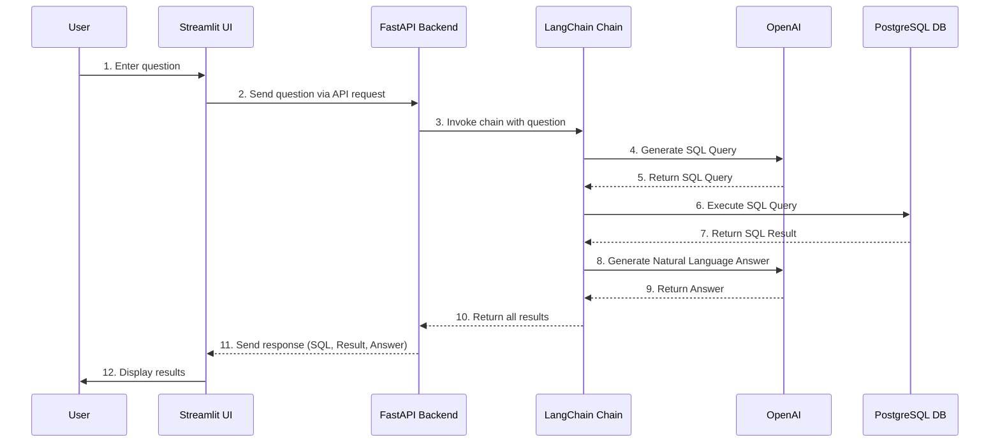

# 📀 Text-to-SQL with LangChain, FastAPI, and Streamlit

This is a demo project that converts natural language questions into SQL queries to retrieve information from the DVD Rental database. It uses a FastAPI backend for the core logic and a Streamlit frontend for the user interface.

## ✨ Features

- **Natural Language to SQL**: Understands user questions and converts them into SQL queries.
- **Natural Language Response**: Generates a natural language answer based on the SQL query results.
- **Database Integration**: Connects to a PostgreSQL database to query real data.
- **LangChain Integration**: Utilizes LangChain to build an efficient Text-to-SQL pipeline.
- **Separated Backend/Frontend**: A FastAPI backend handles the logic, while a Streamlit app provides the UI.

## Workflow



## 🛠️ Tech Stack

- **Language**: Python 3.11
- **Backend**: FastAPI
- **Frontend**: Streamlit
- **Core Logic**: LangChain
- **Database**: PostgreSQL
- **LLM**: OpenAI GPT-3.5-Turbo
- **Key Libraries**: `fastapi`, `uvicorn`, `streamlit`, `langchain`, `langchain-openai`, `psycopg2-binary`

## 🚀 Getting Started

### 1. Set up the Database

If you have Docker, you can start the PostgreSQL database server using the provided `docker-compose.yml` in the `dvdrental` directory.

```bash
# Navigate to the database directory
cd dvdrental

# Start the server
docker-compose up -d
```

### 2. Set up Python Virtual Environment

From the project root directory, create and activate a Python virtual environment.

```bash
# Create a virtual environment (for Python 3.11)
python -m venv venv

# Activate the virtual environment (Windows PowerShell)
.\venv\Scripts\Activate.ps1

# Activate the virtual environment (macOS/Linux)
source venv/bin/activate
```

### 3. Install Dependencies

Install the required Python libraries.

```bash
pip install -r requirements.txt
```

### 4. Set up Environment Variables

Create a `.env` file in the project root directory (`mungyu_version_query_vending_machine`) and add your database credentials and OpenAI API key.

```
DB_USER=your_db_user
DB_PASSWORD=your_db_password
DB_HOST=your_db_host
DB_PORT=your_db_port
DB_NAME=your_db_name
OPENAI_API_KEY=your_openai_api_key
```

### 5. Run the Application

You need to run two processes in separate terminals from the `mungyu_version_query_vending_machine` directory.

**Terminal 1: Start the FastAPI Backend**

```bash
# Make sure your virtual environment is activated
.\venv\Scripts\python.exe -m uvicorn app.main:app --host 127.0.0.1 --port 8000 --reload
```

**Terminal 2: Start the Streamlit Frontend**

```bash
# Make sure your virtual environment is activated
streamlit run streamlit_app.py
```

Now, open your web browser and go to the local URL provided by Streamlit (e.g., `http://localhost:8501`).

---

# 📀 LangChain, FastAPI, Streamlit을 이용한 Text-to-SQL

이 프로젝트는 자연어 질문을 SQL 쿼리로 변환하여 DVD Rental 데이터베이스의 정보를 조회하는 데모입니다. 핵심 로직은 FastAPI 백엔드로, 사용자 인터페이스는 Streamlit 프론트엔드로 구현되었습니다.

## ✨ 주요 기능

- **Text-to-SQL**: 사용자의 질문을 이해하고 SQL 쿼리로 변환합니다.
- **자연어 답변 생성**: SQL 쿼리 결과를 바탕으로 자연스러운 문장 답변을 생성합니다.
- **데이터베이스 연동**: PostgreSQL 데이터베이스에 연결하여 실제 데이터를 조회합니다.
- **LangChain 통합**: LangChain을 활용하여 효율적인 Text-to-SQL 파이프라인을 구축합니다.
- **백엔드/프론트엔드 분리**: FastAPI 백엔드가 로직을 처리하고, Streamlit 앱이 UI를 제공합니다.

## 🛠️ 기술 스택

- **언어**: Python 3.11
- **백엔드**: FastAPI
- **프론트엔드**: Streamlit
- **핵심 로직**: LangChain
- **데이터베이스**: PostgreSQL
- **LLM**: OpenAI GPT-3.5-Turbo
- **핵심 라이브러리**: `fastapi`, `uvicorn`, `streamlit`, `langchain`, `langchain-openai`, `psycopg2-binary`

## 🚀 시작하기

### 1. 데이터베이스 설정

Docker가 설치되어 있다면, `dvdrental` 디렉터리의 `docker-compose.yml` 파일을 사용하여 PostgreSQL 데이터베이스 서버를 시작할 수 있습니다.

```bash
# 데이터베이스 디렉터리로 이동
cd dvdrental

# 서버 시작
docker-compose up -d
```

### 2. Python 가상 환경 설정

프로젝트 루트 디렉터리에서 Python 가상 환경을 생성하고 활성화합니다.

```bash
# 가상 환경 생성 (Python 3.11 기준)
python -m venv venv

# 가상 환경 활성화 (Windows PowerShell)
.\venv\Scripts\Activate.ps1

# 가상 환경 활성화 (macOS/Linux)
source venv/bin/activate
```

### 3. 의존성 설치

필요한 Python 라이브러리를 설치합니다.

```bash
pip install -r requirements.txt
```

### 4. 환경 변수 설정

프로젝트 루트 디렉터리(`mungyu_version_query_vending_machine`)에 `.env` 파일을 생성하고, 데이터베이스 정보와 OpenAI API 키를 입력합니다.

```
DB_USER=your_db_user
DB_PASSWORD=your_db_password
DB_HOST=your_db_host
DB_PORT=your_db_port
DB_NAME=your_db_name
OPENAI_API_KEY=your_openai_api_key
```

### 5. 애플리케이션 실행

`mungyu_version_query_vending_machine` 디렉터리에서 두 개의 터미널을 열고 각각 다음 명령을 실행해야 합니다.

**터미널 1: FastAPI 백엔드 시작**

```bash
# 가상 환경이 활성화되었는지 확인하세요.
.\venv\Scripts\python.exe -m uvicorn app.main:app --host 127.0.0.1 --port 8000 --reload
```

**터미널 2: Streamlit 프론트엔드 시작**

```bash
# 가상 환경이 활성화되었는지 확인하세요.
streamlit run streamlit_app.py
```

이제 웹 브라우저를 열고 Streamlit이 제공하는 로컬 URL(예: `http://localhost:8501`)로 접속하세요.